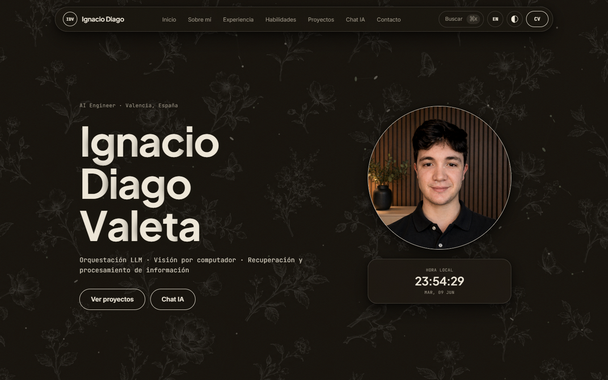
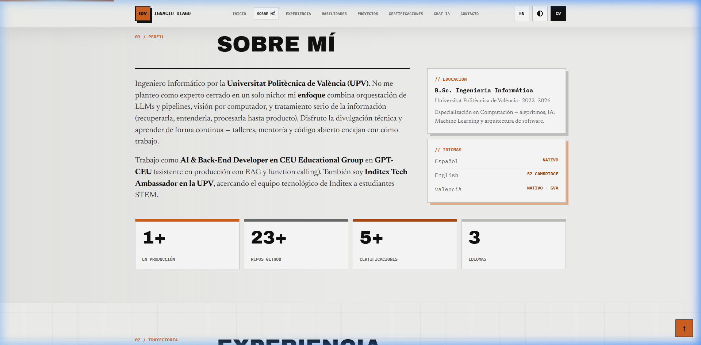
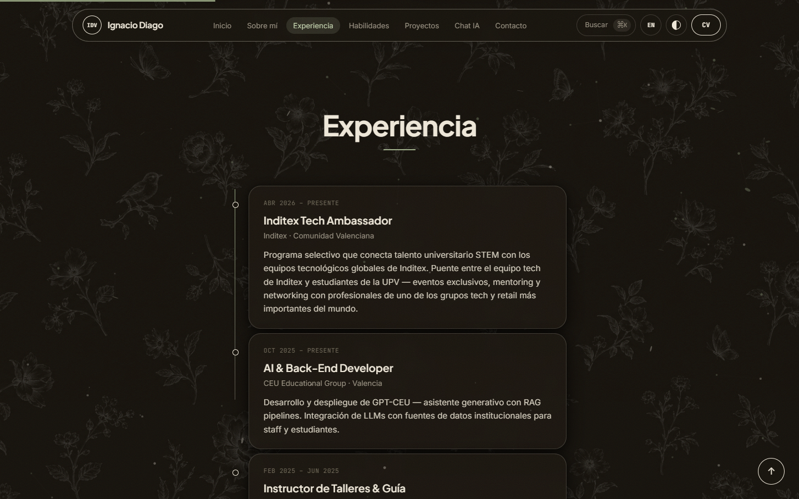
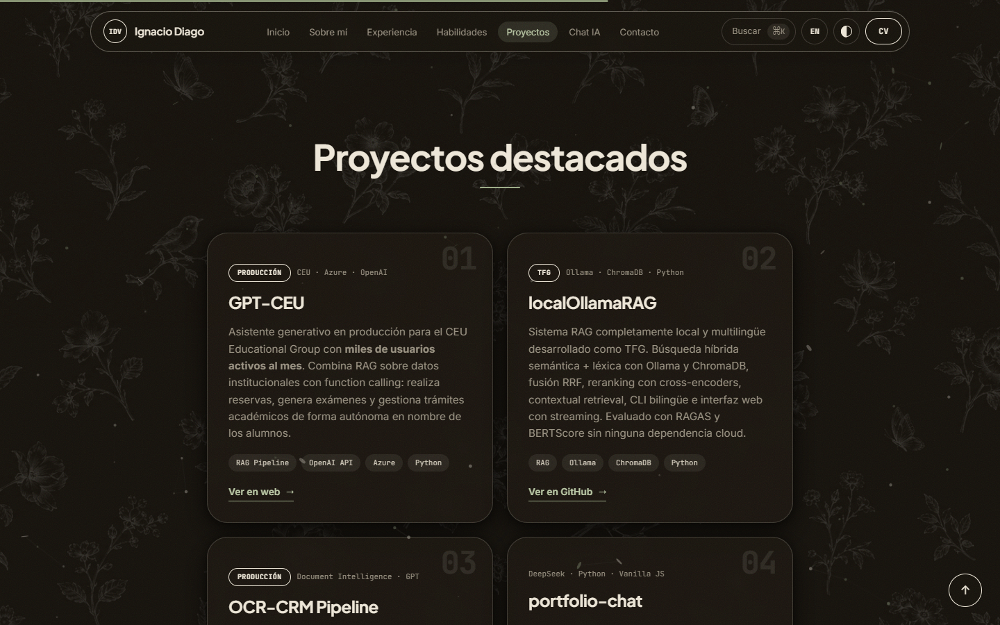
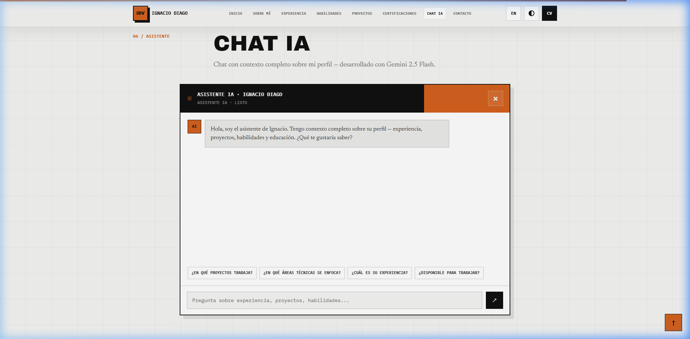

# Ignacio Diago Valeta Portfolio

Interactive portfolio for Ignacio Diago Valeta, AI Engineer focused on LLM orchestration, RAG pipelines, computer vision, and intelligent information processing.

Live site: [portfolio-chat-aouj.onrender.com](https://portfolio-chat-aouj.onrender.com/)

## Why This Portfolio Exists

The idea came from looking at the hiring process from an interviewer's perspective. If I were reviewing a candidate, I would want to ask questions directly to their CV and quickly understand how their experience fits the role.

This portfolio turns that idea into a practical interface: a professional website with an integrated AI chat that can answer questions about my background, projects, skills, and experience.

## Preview

### Hero



### About & Stats



### Experience



### Featured Projects



### AI Chat



These screenshots show the portfolio in light mode. The site includes a dark mode toggle and full bilingual support (ES / EN).

## Tech Stack

- Frontend: HTML, CSS, and vanilla JavaScript
- Backend: Python proxy server
- AI: Google Gemini 2.5 Flash API
- Deployment: Render

## Features

- **AI Chat**: Ask anything about Ignacio's background, projects, and skills directly in the interface
- **Dark / Light mode**: Clean white-and-black palette with orange accents, toggled from the navbar
- **Bilingual**: Full ES / EN support switchable at any point
- **Responsive**: Works on desktop and mobile
- **Live clock**: Displays local Valencia time in the hero card

## Run Locally

Set the Gemini API key and start the Python server:

```bash
export GEMINI_API_KEY="your_api_key"
python server.py
```

On Windows PowerShell:

```powershell
$env:GEMINI_API_KEY="your_api_key"
python server.py
```

Then open:

```text
http://localhost:8000
```

## Project Structure

- `index.html` defines the portfolio sections and page metadata.
- `styles.css` contains the visual design and responsive layout.
- `app.js` handles client-side interactions and bilingual content.
- `config.js` contains the AI assistant context and portfolio data.
- `server.py` serves the site and proxies Gemini requests without exposing the API key.

## Security

The Gemini API key is never exposed to the browser. Requests go through the Python server, which reads the key from the `GEMINI_API_KEY` environment variable and applies basic rate limiting.

## License

MIT
